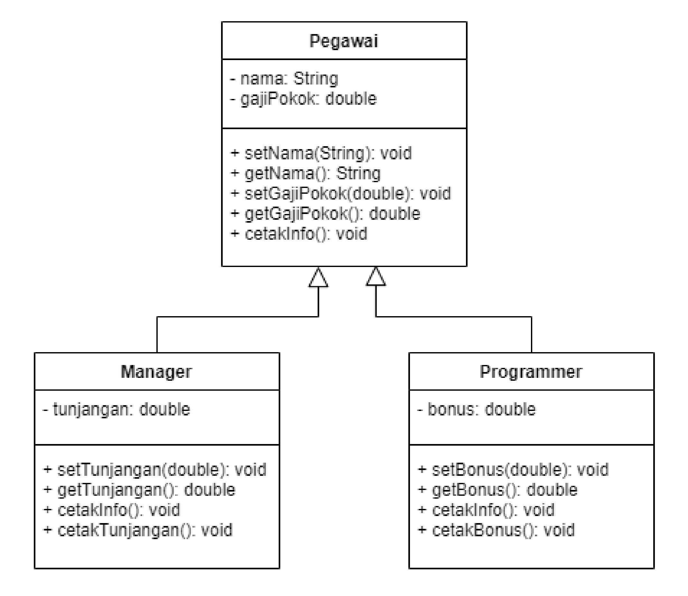
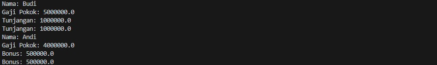

# Pertemuan5_Inheritance

## Profil
| Variable | Isi |
| -------- | --- |
| **Nama** | Intan Virginia Aulia Putri |
| **NIM** | 312310657 |
| **Kelas** | TI.23.A.6 |
| **Mata Kuliah** | Pemrograman Orientasi Objek |

### Latihan
- Lengkapi latihan class Mahasiswa dengan setter dan getter.
- Implementasikan java code diagram class berikut:


Pegawai
``` javascript
public class Pegawai {
    private String nama;
    private double gajiPokok;

    // Setter dan getter untuk nama
    public void setNama(String nama) {
        this.nama = nama;
    }
    public String getNama() {
        return nama;
    }

    // Setter dan getter untuk gaji pokok
    public void setGajiPokok(double gajiPokok) {
        this.gajiPokok = gajiPokok;
    }
    public double getGajiPokok() {
        return gajiPokok;
    }

    // Metode untuk mencetak informasi pegawai
    public void cetakInfo() {
        System.out.println("Nama: " + nama);
        System.out.println("Gaji Pokok: " + gajiPokok);
    }
}
```

Manager
``` Javascript
public class Manager extends Pegawai {
    private double tunjangan;

    // Setter dan getter untuk tunjangan
    public void setTunjangan(double tunjangan) {
        this.tunjangan = tunjangan;
    }
    public double getTunjangan() {
        return tunjangan;
    }

    // Metode untuk mencetak informasi manager
    @Override
    public void cetakInfo() {
        super.cetakInfo();
        System.out.println("Tunjangan: " + tunjangan);
    }

    // Metode tambahan untuk mencetak tunjangan
    public void cetakTunjangan() {
        System.out.println("Tunjangan: " + tunjangan);
    }
}
```

Progammer
``` Javascript
public class Programmer extends Pegawai {
    private double bonus;

    // Setter dan getter untuk bonus
    public void setBonus(double bonus) {
        this.bonus = bonus;
    }
    public double getBonus() {
        return bonus;
    }

    // Metode untuk mencetak informasi programmer
    @Override
    public void cetakInfo() {
        super.cetakInfo();
        System.out.println("Bonus: " + bonus);
    }

    // Metode tambahan untuk mencetak bonus
    public void cetakBonus() {
        System.out.println("Bonus: " + bonus);
    }
}
```

Main Java
``` Javascript
public class Main {
    public static void main(String[] args) {
        // Membuat objek Manager
        Manager manager = new Manager();
        manager.setNama("Budi");
        manager.setGajiPokok(5000000);
        manager.setTunjangan(1000000);
        manager.cetakInfo();
        manager.cetakTunjangan();

        // Membuat objek Programmer
        Programmer programmer = new Programmer();
        programmer.setNama("Andi");
        programmer.setGajiPokok(4000000);
        programmer.setBonus(500000);
        programmer.cetakInfo();
        programmer.cetakBonus();
    }
}
```
### Penjelasan
Class `Pegawai`<br>
Class ini adalah superclass yang memiliki dua atribut utama:
1. **nama**: menyimpan nama pegawai.
2. **gajiPokok**: menyimpan gaji pokok pegawai.
Class ini juga memiliki:
- **Setter dan Getter** untuk masing-masing atribut (`nama` dan `gajiPokok`) untuk mengakses dan memodifikasi nilai dari atribut private ini.
- **Metode `cetakInfo()`** yang digunakan untuk mencetak informasi dasar pegawai, yaitu nama dan gaji pokok.

Class `Manager`<br>
`Manager` adalah subclass dari `Pegawai`, yang artinya `Manager` mewarisi atribut dan metode dari class `Pegawai`. `Manager` memiliki tambahan atribut:
**tunjangan**: untuk menyimpan tunjangan seorang manager.
Class ini juga memiliki:
- **Setter dan Getter** untuk `tunjangan`, sehingga atribut ini dapat diakses dan dimodifikasi.
- **Metode `cetakInfo()`** yang di-override dari superclass (`Pegawai`). Metode ini pertama-tama memanggil `cetakInfo()` dari superclass (menggunakan `super.cetakInfo()`), lalu menambahkan pencetakan tunjangan di bagian bawahnya.
- **Metode tambahan `cetakTunjangan()`** yang hanya mencetak nilai tunjangan.

Class `Programmer`<br>
`Programmer` adalah subclass dari `Pegawai` yang juga mewarisi atribut dan metode dari class `Pegawai`. `Programmer` memiliki tambahan atribut:
**bonus**: untuk menyimpan bonus seorang programmer.
Class ini juga memiliki:
- **Setter dan Getter** untuk `bonus`.
- **Metode `cetakInfo()`** yang di-override dari superclass (`Pegawai`). Metode ini memanggil `super.cetakInfo()` untuk mencetak informasi dasar pegawai, lalu menambahkan pencetakan bonus.
- **Metode tambahan `cetakBonus()`** yang hanya mencetak nilai bonus.

Class `Main`<br>
Class `Main` berisi metode `main()` yang menjadi titik awal eksekusi program:
1. Membuat objek `Manager` dan `Programmer`.
2. Menggunakan **setter** untuk mengisi nama, gaji pokok, tunjangan (untuk `Manager`), dan bonus (untuk `Programmer`).
3. Memanggil metode `cetakInfo()` dan `cetakTunjangan()` untuk `Manager`.
4. Memanggil metode `cetakInfo()` dan `cetakBonus()` untuk `Programmer`.

### Tampilan Output


